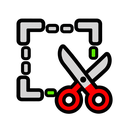
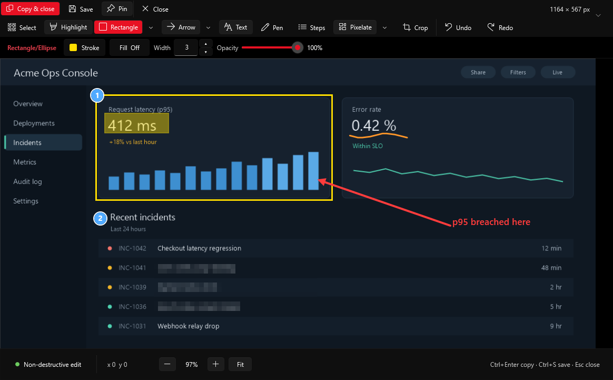
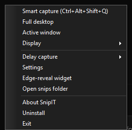
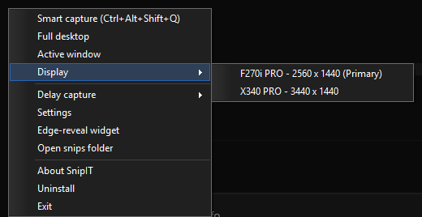
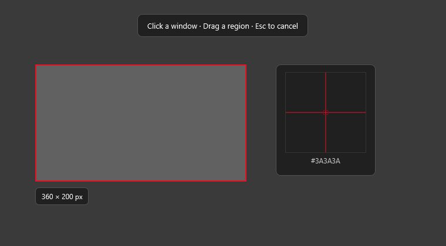
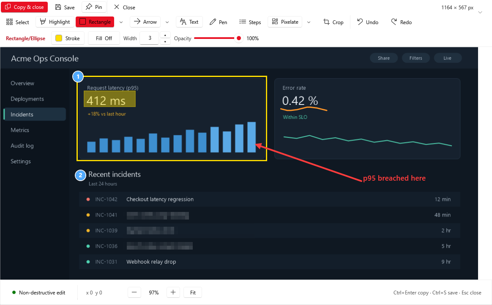
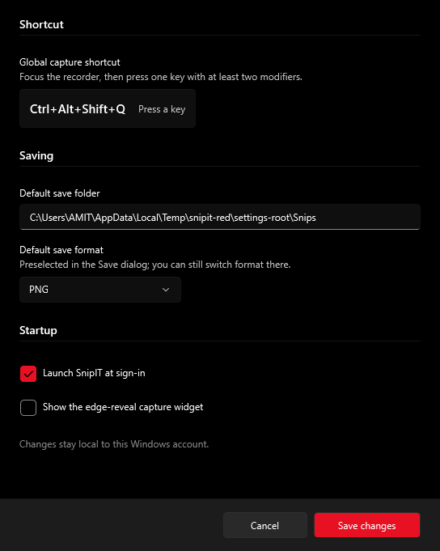

  

<h1 align="center">snipIT — free screenshot and snipping tool for Windows 11</h1>

<strong>Capture. Annotate. Copy or save.</strong>

  snipIT is a free, open source screenshot tool and snipping tool for Windows 11. Capture any window, region, or monitor, annotate with arrows, text, and numbered steps, blur sensitive information before you share it, then copy or save — one file, no installer, no telemetry.

  
  
  
  

  
  
  
  
  

<em>The snipIT editor, with a rectangle, a highlight, numbered steps, a blurred region, a pen stroke, an arrow, and a text label.</em>

## Why snipIT

- **Capture any way you like:** a window, a dragged region, the full desktop, the active window, a single monitor, or a delayed shot.
- **Annotate without touching the original:** highlight, draw rectangles, ellipses, arrows and lines, add text or numbered steps, sketch with a pen, blur or pixelate anything private — all non-destructive, all undoable.
- **Multi-monitor aware:** capture crosses displays cleanly and remembers which monitor you're working on.
- **Finish your way:** copy straight to the clipboard or save as PNG, JPEG, or BMP, to a default folder and format you choose.
- **Feels like Windows:** it follows your light or dark theme, with a clean black-and-white look and a single red accent.
- **Private by design:** nothing leaves your PC, no admin rights, no installer, one file you can read end to end.

## Get started

1. Download `SnipIT.ps1` from the [latest release](https://github.com/RandomCodeSpace/snipIT/releases/latest).
2. Double-click the Desktop shortcut it creates the first time you run it (or just run the file once).
3. Press **Ctrl+Alt+Shift+Q** to capture.

snipIT quietly adds itself to the system tray and to sign-in startup so it's always a shortcut-press away. You can change the capture shortcut any time from the tray icon's **Settings**.

### Requirements

Windows 11 and [PowerShell 7.5 or newer](https://learn.microsoft.com/powershell/scripting/install/installing-powershell-on-windows).

## Take a screenshot on Windows 11

Press `Ctrl+Alt+Shift+Q`, double-click the tray icon, or right-click it and choose a mode.

| Mode | What it does |
|---|---|
| Smart capture | Hover to grab a whole window, or drag to select a custom region |
| Full desktop | Grabs everything across all connected monitors |
| Active window | Captures whatever window is currently in front |
| Display | Pick one connected monitor by name from the tray menu |
| Delayed capture | Runs any of the above after a short delay, so you can set up the shot |

Press `Esc` any time to cancel.

<table>
  <tr>
    <td align="center"> <em>Tray menu</em></td>
    <td align="center"> <em>Display submenu</em></td>
  </tr>
</table>

Smart capture shows you exactly what you're about to grab: a live size readout, a magnifier for pixel-precise edges, and it works cleanly across every monitor you drag across.

  

<em>Smart capture in progress — the size readout follows the region, and the magnifier zooms in on the exact pixel under the corner you're dragging.</em>

## Annotate a screenshot

Once you capture something, it opens straight into the editor.

| Tool | What it does |
|---|---|
| Select | Pick an annotation to move, resize, duplicate, or delete it |
| Highlight | Mark up text or areas without hiding what's underneath |
| Rectangle / Ellipse | Draw a shape around something |
| Arrow / Line | Point at something or connect two things |
| Text | Add a caption or label |
| Pen | Freehand drawing |
| Steps | Numbered badges that auto-increment, and renumber if you delete one |
| Blur / Pixelate | Hide anything sensitive before you share it |
| Crop | Trim the capture down to just what matters |
| Undo / Redo | Step backward or forward through your edits |

Every annotation stays editable until you copy or save, so you can always change your mind.

### Blur sensitive information before sharing

Drag the Blur or Pixelate tool over a password field, an account number, a face, or anything else you don't want in the shared image. It obscures the actual pixels underneath — not a solid box — so the effect matches exactly between the on-screen preview and the file you copy or save.

## Save or copy a screenshot

- **Copy & close** puts the finished image on your clipboard and closes the editor.
- **Copy and keep editing** does the same but leaves the editor open (`Ctrl+C`, or the arrow next to Copy & close).
- **Save** opens a normal file dialog for PNG, JPEG, or BMP.
- If you applied a crop, both copy and save use the cropped result.
- Pick your default save folder and format once in **Settings**, and every save starts there.

  

## Keyboard shortcuts for snipIT

| Shortcut | Action |
|---|---|
| `Ctrl+Alt+Shift+Q` | Smart capture (configurable in Settings) |
| `Esc` | Cancel capture, dismiss the current action, or close the editor |
| `Ctrl+Enter` | Copy and close |
| `Ctrl+C` / `Ctrl+Shift+C` | Copy and keep editing |
| `Ctrl+S` | Save |
| `Ctrl+N` | Start a new Smart capture |
| `Ctrl+Z` | Undo |
| `Ctrl+Shift+Z` | Redo |
| `Ctrl++` / `Ctrl+-` | Zoom in / out |
| `Ctrl+0` | Fit the image to the window |
| `Space` (held) | Pan around a zoomed-in image |
| `Delete` | Delete the selected annotation |
| Arrow keys / `Shift`+Arrow keys | Nudge the selection by 1 / 10 pixels |

## Privacy

- snipIT has no telemetry, no analytics, and no cloud upload of any kind.
- Your screenshots go only to the clipboard or to a file you choose.
- It runs without administrator rights and doesn't install any background service.

## Good to know

- Only one snipIT can run per Windows sign-in at a time; opening it again just points you back to the running tray icon.
- It's a Windows-only app — there's no macOS or Linux build.

## Uninstall

Right-click the tray icon, choose **Uninstall**, and confirm. This removes the shortcuts and everything snipIT stored for itself, but never touches screenshots you've already saved elsewhere.

## FAQ

**Is snipIT free?** Yes — snipIT is free and open source under the MIT licence, with no ads, no paid tiers, and no account required.

**Does it need admin rights?** No — snipIT runs entirely in your user account and never asks for administrator privileges.

**Does it work with multiple monitors?** Yes — capture can span every connected display, and you can also target one specific monitor by name from the tray menu.

**Can it blur or pixelate parts of a screenshot?** Yes — the Blur and Pixelate tools obscure any dragged region, such as passwords or personal details, before you copy or save.

**Is it an alternative to the Windows Snipping Tool, ShareX, Greenshot, or Lightshot?** Yes — snipIT covers the same capture-annotate-share workflow in a single portable script, with no installer and no telemetry.

**Where do screenshots go?** Only where you send them — to the clipboard, or to a file in the folder and format you choose in Settings; snipIT never uploads anything anywhere.

## Support and contributing

Found a bug or have an idea? Open an [issue](https://github.com/RandomCodeSpace/snipIT/issues). Want to contribute code? Start with [CONTRIBUTING.md](CONTRIBUTING.md). Found a security problem? Please read [SECURITY.md](SECURITY.md) instead of filing a public issue. Curious what's changed release to release? Check the [CHANGELOG.md](CHANGELOG.md).

Licensed under [MIT](LICENSE).
